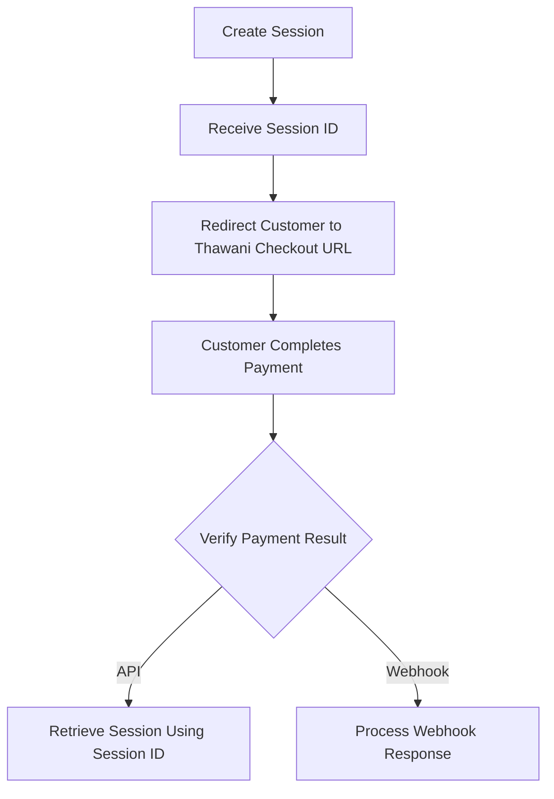
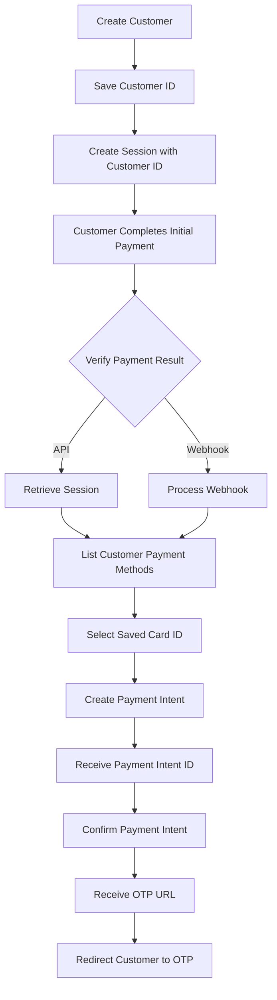
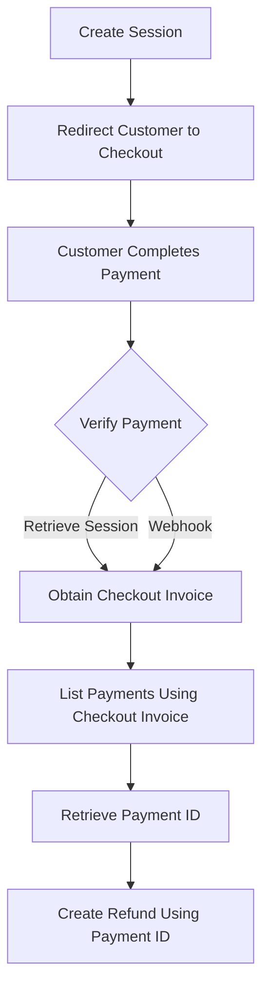

# Thawani Payment Gateway Integration

> Source: **Thawani Mini Document**  
> Original document length: 1 page  
> Formatting has been cleaned for Markdown. The wording, credentials, URLs, and process sequence are preserved from the source document.

## Official API Documentation

- [Thawani ECommerce API Documentation](https://docs.thawani.om/)

---

## Original Document Content

Thank you for choosing Thawani payment gateway as the service provider for your platform. Your technical team can start the integration using our API document which uploaded on:

- [https://docs.thawani.om](https://docs.thawani.om/)

The integration flow depends on the case and features as below:

## 1st Scenario: Only Payment Without Tokenization

1. Create a checkout session:
   - [Create Session | Thawani Pay](https://thawani-technologies.stoplight.io/docs/thawani-ecommerce-api/a2a9e57e10521-create-session)

2. Redirect the customer to the following checkout URL format:

   ```text
   https://uatcheckout.thawani.om/pay/{session_id}?key=publishable_key
   ```

3. After payment, use the session ID to check the payment status:
   - [Retrieve Session | Thawani Pay](https://thawani-technologies.stoplight.io/docs/thawani-ecommerce-api/50259f1e290c9-retrieve-session)
   - Alternatively, check the webhook response.

### Flow Diagram



---

## 2nd Scenario: Saved Card Payment

1. Create a customer:
   - [Create Customer | Thawani Pay](https://thawani-technologies.stoplight.io/docs/thawani-ecommerce-api/82010ac1dc24d-create-customer)
   - Save the customer ID received from Thawani.

2. Create a checkout session:
   - [Create Session | Thawani Pay](https://thawani-technologies.stoplight.io/docs/thawani-ecommerce-api/a2a9e57e10521-create-session)
   - Include the customer ID in the request body.

3. After payment, use the session ID to check the payment status:
   - [Retrieve Session | Thawani Pay](https://thawani-technologies.stoplight.io/docs/thawani-ecommerce-api/50259f1e290c9-retrieve-session)
   - Alternatively, check the webhook response.

4. To pay using a saved card:
   - Retrieve the customer's saved cards using [List a Customer's Payment Method | Thawani Pay](https://thawani-technologies.stoplight.io/docs/thawani-ecommerce-api/7ed854827860e-list-a-customer-s-payment-method).
   - Use the selected card ID with [Create Payment Intent | Thawani Pay](https://thawani-technologies.stoplight.io/docs/thawani-ecommerce-api/ab5123a837d17-create-payment-intent).
   - Take the returned payment intent ID and confirm it using [Confirm Payment Intent | Thawani Pay](https://thawani-technologies.stoplight.io/docs/thawani-ecommerce-api/6ad0ec35c2b08-confirm-payment-intent).
   - Redirect the customer to the OTP URL returned in the confirmation response.

### Flow Diagram



---

## UAT / Test Environment

For integration and testing, start with the UAT/Test environment.

### Base URL

```text
https://uatcheckout.thawani.om
```

### UAT Credentials

```text
UAT Secret Key: rRQ26GcsZzoEhbrP2HZvLYDbn9C9et
UAT Publishable Key: HGvTMLDssJghr9tlN9gr4DVYt0qyBy
```

### Test Cards

Use the official UAT test-card information:

- [Thawani Test Card | Thawani Pay](https://thawani-technologies.stoplight.io/docs/thawani-ecommerce-api/7c0f75e1668d7-thawani-test-card)

---

## Refund Process

1. Create a checkout session:
   - [Create Session | Thawani Pay](https://thawani-technologies.stoplight.io/docs/thawani-ecommerce-api/a2a9e57e10521-create-session)

2. Redirect the customer to the checkout URL:

   ```text
   https://uatcheckout.thawani.om/pay/{session_id}?key=publishable_key
   ```

3. After payment, verify the payment result:
   - [Retrieve Session | Thawani Pay](https://thawani-technologies.stoplight.io/docs/thawani-ecommerce-api/50259f1e290c9-retrieve-session)
   - Alternatively, check the webhook response.

4. Take the checkout invoice and use it with:
   - [List Payments | Thawani Pay](https://thawani-technologies.stoplight.io/docs/thawani-ecommerce-api/0c4c69546b6ae-list-payments)

5. Retrieve the payment ID from the payment list response.

6. Use the payment ID to create the refund:
   - [Create a Refund | Thawani Pay](https://thawani-technologies.stoplight.io/docs/thawani-ecommerce-api/cc21ee27b164f-create-a-refund)

### Flow Diagram



---

## Embedded Link Index

The PDF contains 23 hyperlink annotations, including repeated annotations caused by links wrapping across multiple lines. These resolve to **11 unique destinations**.

| # | Link | Purpose |
|---:|---|---|
| 1 | [Thawani API Documentation](https://docs.thawani.om/) | Main API documentation portal |
| 2 | [Create Session](https://thawani-technologies.stoplight.io/docs/thawani-ecommerce-api/a2a9e57e10521-create-session) | Create a checkout session |
| 3 | [Checkout Redirect URL Template](https://uatcheckout.thawani.om/pay/%7Bsession_id%7D?key=publishable_key) | Redirect customer to UAT checkout |
| 4 | [Retrieve Session](https://thawani-technologies.stoplight.io/docs/thawani-ecommerce-api/50259f1e290c9-retrieve-session) | Retrieve session and payment status |
| 5 | [Create Customer](https://thawani-technologies.stoplight.io/docs/thawani-ecommerce-api/82010ac1dc24d-create-customer) | Create a customer for tokenized/saved-card payment |
| 6 | [List a Customer's Payment Method](https://thawani-technologies.stoplight.io/docs/thawani-ecommerce-api/7ed854827860e-list-a-customer-s-payment-method) | Retrieve saved cards/payment methods |
| 7 | [Create Payment Intent](https://thawani-technologies.stoplight.io/docs/thawani-ecommerce-api/ab5123a837d17-create-payment-intent) | Start a saved-card payment |
| 8 | [Confirm Payment Intent](https://thawani-technologies.stoplight.io/docs/thawani-ecommerce-api/6ad0ec35c2b08-confirm-payment-intent) | Confirm the intent and receive an OTP URL |
| 9 | [Thawani Test Card](https://thawani-technologies.stoplight.io/docs/thawani-ecommerce-api/7c0f75e1668d7-thawani-test-card) | Test-card information for UAT |
| 10 | [List Payments](https://thawani-technologies.stoplight.io/docs/thawani-ecommerce-api/0c4c69546b6ae-list-payments) | Find a payment using the checkout invoice |
| 11 | [Create a Refund](https://thawani-technologies.stoplight.io/docs/thawani-ecommerce-api/cc21ee27b164f-create-a-refund) | Create a refund using the payment ID |

---

## Technical Review

### What the mini document clearly defines

- A non-tokenized one-time payment flow.
- A customer-based saved-card payment flow.
- Payment verification through either the Retrieve Session API or a webhook.
- OTP redirection after confirming a saved-card payment intent.
- A refund flow based on checkout invoice lookup and payment ID retrieval.
- UAT checkout URL, UAT credentials, and the official test-card documentation link.

### Information not included in the mini document

The mini document does **not** contain the complete API contract. The linked API pages must be used for the following details:

- HTTP methods and exact API endpoint paths.
- Required and optional request fields.
- Request and response JSON schemas.
- Header names and authentication requirements.
- Webhook event structure and webhook-signature validation.
- Error codes and failed-payment states.
- Idempotency and duplicate-payment handling.
- Production base URLs and production credentials.
- Payment-intent expiration and retry behavior.
- Refund eligibility, refund status, partial refunds, and refund limits.

### Security Notes

- The **Secret Key must only be used on the backend/server**.
- Never expose the Secret Key in browser code, mobile apps, public repositories, logs, or client-side environment variables.
- The Publishable Key is intended for checkout redirection or client-facing use where supported by the official documentation.
- Verify payment status on the backend before marking an order as paid.
- Do not trust only the browser success redirect; use Retrieve Session and/or a validated webhook.
- Keep UAT and production credentials completely separate.

### Documentation Access Note

The official documentation portal and endpoint links are hosted on Stoplight. Their pages depend on JavaScript, so basic text-only crawlers may display only the Stoplight page shell. The exact embedded links from the PDF have therefore been preserved above without inventing request fields or response schemas that are not present in the source document.
